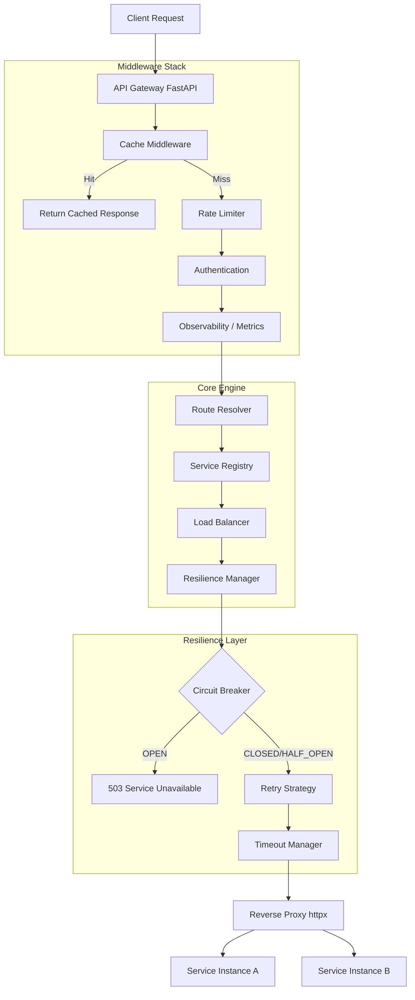
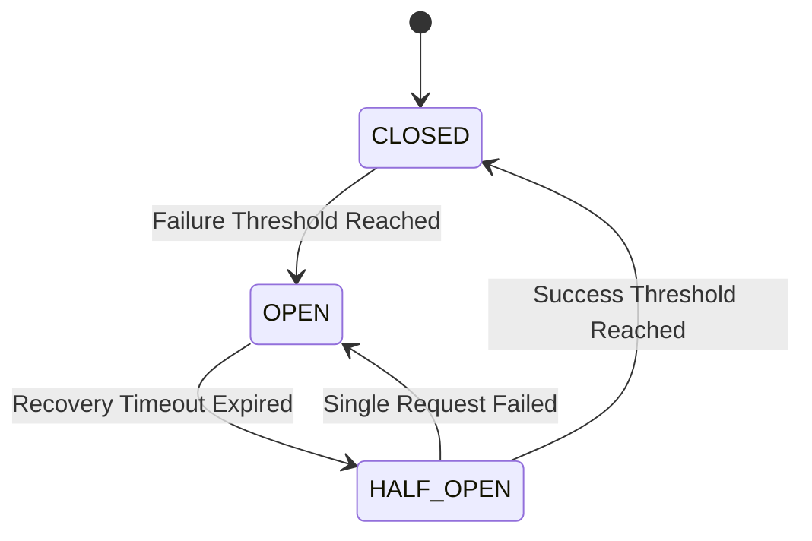

<div align="center">

# 🌌 Custom API Gateway

[](https://www.python.org/)
[](https://fastapi.tiangolo.com/)
[](https://redis.io/)
[](https://prometheus.io/)
[](https://grafana.com/)
[](#)

A high-performance, asynchronous API Gateway built entirely from scratch in Python, designed to handle routing, resilience, rate-limiting, load-balancing, and observability for distributed microservices.

</div>

---

## 1. Project Overview

### What is the API Gateway?
This project is a custom, fully-featured API Gateway developed in Python using the ASGI ecosystem (FastAPI, Uvicorn) and `httpx`. It serves as the single entry point for all client requests, abstracting away the complexity of downstream microservices. It intercepts incoming HTTP traffic, applies a series of middleware policies (authentication, caching, rate limiting, and observability), routes the request to the appropriate backend service using a dynamically updated load balancer, handles resilience (circuit breaking, retries, timeouts), and returns the downstream response to the client.

### Why API Gateways Exist
In a microservices architecture, clients shouldn't communicate directly with dozens of distinct backend services. Doing so creates massive overhead:
- **Coupling:** Clients must know the exact IP/hostname of every service.
- **Redundancy:** Every service must independently implement authentication, rate limiting, and CORS.
- **Security:** Exposing all microservices directly to the public internet dramatically increases the attack surface.
- **Performance:** Clients making multiple requests to aggregate data suffer from high latency.

An API Gateway centralizes these cross-cutting concerns. It acts as a reverse proxy that shields the internal network topology from the outside world.

### Why Build This From Scratch?
Industry standards like **NGINX**, **Envoy**, **Kong**, or **Traefik** are highly optimized (often written in C/C++, Rust, or Go) and are the correct choice for most production environments. 

However, deploying an existing binary teaches you configuration, not engineering. This project was built from scratch to deeply understand the **internal mechanics** of distributed systems. Building a gateway from zero forces you to confront the realities of:
- Asynchronous non-blocking I/O.
- Managing concurrent connection pools.
- Designing thread-safe circuit breaker state machines.
- Implementing complex rate-limiting algorithms (Token Bucket, Leaky Bucket) using Redis Lua scripts.
- Understanding the exact lifecycle of an HTTP request as it traverses a proxy layer.

### High-Level Feature Summary
- **Resilience:** Circuit Breakers, Exponential Backoff Retries, and Granular Timeouts.
- **Traffic Control:** Multi-algorithm Rate Limiting (Token Bucket, Leaky Bucket, Fixed/Sliding Window).
- **Load Balancing:** Round Robin, Weighted Round Robin, and Least Connections algorithms.
- **Observability:** Native Prometheus metrics (latency, error rates, circuit breaker state) and structured logging.
- **Performance:** Redis-backed caching with configurable TTLs.
- **Safety:** Strict configuration validation at startup to prevent runtime routing failures.

---

## 2. Features

### Routing & Reverse Proxy
- **What it is:** The core engine that maps incoming URL paths (e.g., `/users/*`) to downstream services (e.g., `http://user-service:8001`).
- **How it works:** Uses a YAML-based `RouteRegistry` matched against incoming `FastAPI` wildcard paths. It utilizes `httpx.AsyncClient` to asynchronously forward the body, headers, and query parameters, streaming the response back.

### Load Balancing
- **What it is:** Distributes incoming requests across multiple instances of a target service.
- **How it works:** Supports multiple algorithms.
  - *Round Robin:* Cycles through instances sequentially.
  - *Weighted Round Robin:* Respects capacity differences between nodes.
  - *Least Connections:* Tracks active `httpx` connections per instance and routes traffic to the node currently handling the fewest requests.

### Circuit Breaker
- **What it is:** Prevents cascading failures by stopping requests to a failing service.
- **How it works:** Implements a finite state machine (`CLOSED` -> `OPEN` -> `HALF_OPEN`). When a threshold of `httpx.TimeoutException` or 5xx errors is reached, it trips to `OPEN`, immediately rejecting requests. After a timeout, it transitions to `HALF_OPEN` to test recovery.

### Retry & Timeout
- **What it is:** Handles transient network anomalies.
- **How it works:** Configurable connection, read, and write timeouts. If a request fails due to a transient error, the retry policy applies an exponential backoff algorithm to re-attempt the request before giving up.

### Rate Limiting
- **What it is:** Protects downstream services from abuse, DDoS, or runaway scripts.
- **How it works:** Utilizes Redis as a centralized state store. Supports advanced algorithms like Token Bucket and Leaky Bucket, allowing for burst traffic while maintaining a strict average rate.

### Authentication
- **What it is:** Centralized identity verification.
- **How it works:** Intercepts requests and validates JWTs or API keys. Downstream services can assume the request is authenticated, drastically simplifying their codebase.

### Caching
- **What it is:** Reduces latency and backend load by storing identical request responses.
- **How it works:** A Redis-backed middleware that hashes the request path and query parameters. If a hit occurs, the gateway returns the cached response instantly, completely bypassing the routing layer.

### Observability
- **What it is:** Provides deep insight into the health and performance of the gateway and microservices.
- **How it works:** Integrates `prometheus_client`. Exposes a `/metrics` endpoint scraped by Prometheus, measuring request duration histograms, total requests, error rates, and circuit breaker states. Context variables (`contextvars`) inject trace context into logs.

### Configuration Validation
- **What it is:** Ensures safety before accepting traffic.
- **How it works:** At startup, `validator.py` parses all YAML files. It checks for duplicate routes, references to non-existent services, invalid timeout values, and malformed YAML. If validation fails, the gateway crashes immediately (Fail-Fast principle).

---

## 3. Complete Architecture

### Overall Request Flow



### Circuit Breaker State Machine



---

## 4. Folder Structure

The project is structured by domain, isolating concerns and ensuring that the codebase remains navigable as complexity scales.

<details>
<summary>Click to expand folder explanations</summary>

* **`auth/`**: Contains identity validation logic. Includes the middleware and strategy pattern implementations for JWT and API keys.
* **`cache/`**: Redis-based caching logic. Contains the middleware that intercepts requests before they hit the routing layer.
* **`config/`**: Contains the YAML configurations (routes, services, timeouts, retries) and the critical `validator.py` which enforces config integrity at startup.
* **`gateway/`**: The core application logic. 
  * `app.py`: The FastAPI application, middleware registration, and ASGI entry point.
  * `proxy.py`: The `httpx` wrapper that forwards requests to backends.
  * `resilience/`: The circuit breaker, retry, and timeout implementations.
* **`load_balancer/`**: Contains the routing algorithms (Round Robin, Least Connections) and the service registry.
* **`observability/`**: Prometheus metrics, health check endpoints, structured logging, and context variable management for tracing.
* **`rate_limiter/`**: Implementations of rate-limiting algorithms (Fixed Window, Token Bucket, etc.) using Redis.
* **`routing/`**: Resolves incoming URL paths against the defined `routes.yaml` to identify the target logical service.
* **`tests/`**: Pytest suite for unit and integration testing.
* **`benchmarks/`**: Load testing scripts (k6) to measure throughput and latency.

</details>

---

## 5. Request Lifecycle

When an HTTP request arrives at the Gateway, it passes through a meticulously ordered pipeline. In ASGI (Starlette/FastAPI), middlewares execute in a specific wrapping order. 

1. **Cache Middleware:** The outermost layer. Hashes the request path and parameters. If a valid Redis key exists, the response is returned immediately. Downstream systems are untouched.
2. **Rate Limit Middleware:** Evaluates the request against the Redis rate-limiting algorithm. If the client has exceeded their quota, a `429 Too Many Requests` is returned.
3. **Authentication Middleware:** Validates the presence and signature of a JWT or API Key. If invalid, returns `401 Unauthorized`.
4. **Observability Middleware:** Starts a high-resolution timer. Attaches context variables for logging. 
5. **Route Resolution:** The gateway matches the request path (e.g., `/users`) to a logical service (e.g., `user-service`) using `routes.yaml`.
6. **Load Balancing:** The `LoadBalancerManager` queries the `ServiceRegistry` for healthy instances of `user-service` and selects one (e.g., `http://service-a:8001`) using the configured algorithm (e.g., Least Connections).
7. **Resilience & Proxy:** The request enters the `ResilienceManager`.
   - The **Circuit Breaker** checks if the `user-service` state is `OPEN`. If so, it fails fast (`503`).
   - The **Retry Policy** prepares to execute the request.
   - The `httpx` AsyncClient fires the request with configured **Timeouts**.
8. **Response Return:** The response is streamed back, Prometheus metrics are recorded (latency, status codes), and the cache is optionally populated.

---

## 6. Every Major Component Deep-Dive

### Rate Limiter
- **Purpose:** Protect infrastructure from abuse.
- **How it works internally:** Implemented in `rate_limiter/algorithms/`. It uses Redis to maintain state across multiple Gateway workers. 
- **Algorithms:** Includes Token Bucket (allows bursts but enforces average rate), Leaky Bucket (strictly smooths traffic), and Sliding Window. 
- **Trade-offs:** Token Bucket in Redis requires LUA scripts to ensure atomicity between reading the current token count, calculating refill based on timestamps, and decrementing the bucket. Time complexity is $O(1)$ per request.

### Load Balancer
- **Purpose:** Distribute traffic evenly and efficiently.
- **How it works internally:** Found in `load_balancer/algorithms/`. The most complex is **Least Connections**. It tracks active connections on a per-instance basis. In `app.py`, an instance's `active_connections` counter is incremented before `proxy.forward()` and decremented in a `finally` block.
- **Trade-offs:** Round Robin is $O(1)$ but ignorant of backend load. Least Connections is $O(N)$ (where N is the number of instances for a specific service) to find the minimum, but provides vastly superior load distribution in systems with variable response times.

### Circuit Breaker
- **Purpose:** Prevent cascading failures and network congestion.
- **How it works internally:** `gateway/resilience/circuit_breaker.py`. It uses an `asyncio.Lock` to manage state transitions cleanly in a highly concurrent environment.
- **Algorithms:** When failures breach `failure_threshold`, it enters `OPEN`. After `recovery_timeout`, it shifts to `HALF_OPEN`. *Crucially*, during `HALF_OPEN`, only a single request is allowed to pass to test the waters. This is achieved via a `half_open_in_progress` boolean flag guarded by the lock.
- **Trade-offs:** Implementing circuit breakers locally per Gateway instance means they don't share state. If you have 5 Gateway replicas, each maintains its own breaker. Using Redis for shared state would introduce too much latency for a critical path operation.

### Observability
- **Purpose:** Understand system behavior in production.
- **How it works internally:** Uses `prometheus_client` to expose `/metrics`. We use Python `contextvars` (`observability/context.py`) to store the resolved `service_name`. This allows deeply nested modules (like the Circuit Breaker) to log metrics and errors tagged with the specific downstream service without having to pass the `service_name` down through 10 function signatures.

### Configuration Validator
- **Purpose:** "Fail-Fast" on misconfiguration.
- **How it works internally:** `config/validator.py` runs *before* the FastAPI app starts. It guarantees relational integrity across YAML files (e.g., ensuring a service referenced in `routes.yaml` actually exists in `services.yaml`) and bounds-checking (e.g., timeouts > 0).

---

## 7. Design Decisions

### Why FastAPI & ASGI?
API Gateways are heavily I/O bound. They spend 99% of their time waiting for network sockets. Using a synchronous framework (like Flask or Django) would require one OS thread per connection, leading to thread starvation under load. FastAPI, built on Starlette and `asyncio`, allows a single event loop to multiplex thousands of concurrent connections efficiently.

### Why HTTPX over Aiohttp?
While `aiohttp` is slightly faster, `httpx` provides a much cleaner, requests-like API and phenomenal support for connection pooling and timeouts. The maintainability benefits outweighed the marginal performance delta.

### Why YAML for Configuration?
YAML provides excellent human readability, supports comments (unlike JSON), and handles nested structures cleanly. It is the de-facto standard for infrastructure (Kubernetes, Docker Compose, Prometheus).

### Why Redis?
We needed a fast, centralized, atomic state store for Rate Limiting and Caching. Local memory caching (like Python dictionaries) fails when you horizontally scale the gateway across multiple Docker containers, as each container would have its own independent cache and rate limits.

---

## 8. Engineering Challenges

Building a Gateway from scratch presented severe edge cases and concurrency challenges.

### 1. Circuit Breaker "Thundering Herd" in Half-Open State
**Problem:** When the Circuit Breaker transitioned from `OPEN` to `HALF_OPEN`, a massive burst of waiting concurrent requests would immediately hit the `allow_request()` method. Without strict locking, hundreds of requests would pass through to the fragile backend before the first request even returned a success/failure.
**Solution:** Introduced a `half_open_in_progress` flag protected by an `asyncio.Lock`. In `HALF_OPEN`, the first request flips this flag. Subsequent concurrent requests see the flag and are immediately rejected, protecting the backend while the single probe request verifies health.

### 2. Active Connections Tracking (Least Connections)
**Problem:** To implement Least Connections balancing, we needed to know how many requests were currently executing on an instance. Tracking this accurately inside asynchronous Python is tricky due to exceptions.
**Solution:** Handled in `gateway/app.py`. The counter is incremented *before* the proxy call, and decremented in a strict `finally` block to guarantee accuracy even if the `httpx` client throws a `TimeoutException`.

### 3. Middleware Ordering Caveats
**Problem:** Starlette/FastAPI executes middlewares in the reverse order of how they are added (`add_middleware`). Initially, Observability was missing cache hits because the Cache middleware returned early.
**Solution:** Carefully orchestrated the middleware stack. Cache is added first (outermost), so it executes first on the way in. However, to track metrics for cache hits, the Observability middleware had to be decoupled or ordered specifically so that it encompasses the cache logic.

### 4. Context Propagation for Metrics
**Problem:** The `CircuitBreaker` class deep inside the resilience package needed to know the `service_name` to correctly label Prometheus metrics (`GATEWAY_CIRCUIT_OPEN_TOTAL.labels(service=...)`), but passing `service_name` through the entire call stack polluted the architecture.
**Solution:** Leveraged Python 3.7+ `contextvars`. The routing layer sets `service_name_var.set(route.service)`. The context is isolated per `asyncio` task (per request), allowing deep layers to cleanly extract request-specific metadata.

---

## 9. Testing

The gateway emphasizes reliability through automated testing.

- **Unit Tests:** `pytest` is used to validate algorithmic correctness (e.g., `test_least_connections.py` verifies the min-finding logic, `test_load_balancer.py` verifies Round Robin state).
- **Integration Tests:** `test_discovery.py` and `test_cache.py` validate interaction with Redis and configuration files.

### Verifying Resilience (Manual/Integration)
1. **Timeouts:** Route a path to an endpoint that explicitly sleeps for 5 seconds. Set the Gateway timeout to 2 seconds. Verify `504 Gateway Timeout` is returned.
2. **Circuit Breaker:** Kill a backend service. Send 10 requests. Watch the logs. The first few will trigger Timeouts/Retries. Once `failure_threshold` is hit, subsequent requests immediately return `503 Circuit Open` without network delay. Wait `recovery_timeout`, send one request, watch it transition to `HALF_OPEN`.

---

## 10. Benchmarks

Performance testing was conducted using **k6** (`benchmarks/benchmark.js`). 

**Scenario:** Ramp up to 50 concurrent virtual users over 10 seconds, sustain for 20 seconds.
- **Cached Endpoints:** Redis cache hits bypass routing and HTTP overhead, serving responses in < 5ms.
- **Resilience Overhead:** The addition of Circuit Breaker locks and Least Connection tracking adds approximately ~2-4ms of computational overhead per request, well within acceptable bounds for a Python-based proxy.

*(Note: Exact throughput numbers depend on the underlying hardware and UVloop implementation. For production high-throughput, Python ASGI servers generally cap out around 10k-20k RPS per core).*

---

## 11. Installation

### Prerequisites
- Docker & Docker Compose
- Python 3.11+ (if running bare-metal)

### Running via Docker Compose (Recommended)
This spins up the Gateway, Redis, Prometheus, Grafana, and mock downstream backend services.

```bash
git clone https://github.com/yourusername/api-gateway.git
cd api-gateway
docker-compose up --build
```
- Gateway is available on `http://localhost:8000`
- Prometheus is available on `http://localhost:9090`
- Grafana is available on `http://localhost:3000`

### Running Locally (Development)
```bash
python -m venv venv
source venv/bin/activate
pip install -r requirements.txt
uvicorn gateway.app:app --host 0.0.0.0 --port 8000 --reload
```

---

## 12. Configuration Guide

The gateway is entirely data-driven via YAML files in the `config/` and `routing/` directories.

### `routing/routes.yaml`
Defines logical downstream services and the URL paths mapped to them.
```yaml
services:
  user-service:
    url: http://service-a:8001
routes:
  - path: /users
    service: user-service
    methods: [GET, POST]
```

### `load_balancer/services.yaml`
Defines the physical instances (IP/Ports) that make up a logical service for load balancing.
```yaml
services:
  user-service:
    instances:
      - url: "http://user-service-1:8001"
      - url: "http://user-service-2:8001"
```

### `config/circuit_breaker.yaml`
```yaml
failure_threshold: 5     # Errors before opening circuit
success_threshold: 2     # Successes needed in HALF_OPEN to close
recovery_timeout: 30     # Seconds to wait in OPEN before trying HALF_OPEN
```

### `config/retry.yaml` & `config/timeout.yaml`
```yaml
attempts: 3
backoff: 2.0  # Exponential backoff multiplier
```
```yaml
connect: 2.0  # Seconds to wait for socket connection
read: 5.0     # Seconds to wait for data transmission
write: 5.0    # Seconds to wait to send request body
```

---

## 13. API Documentation

### System Endpoints
- **`GET /health`**: Returns the health status of the Gateway, Redis connection, and downstream services.
- **`GET /metrics`**: Prometheus-formatted metrics scrape target.

### Proxied Endpoints
Any endpoint defined in `routes.yaml` is dynamically proxied.
- **`GET /users`**: Proxies to the `user-service`.
- **`GET /orders`**: Proxies to the `order-service`.

**Example Request:**
```bash
curl -X GET http://localhost:8000/users \
     -H "X-API-Key: secret123"
```

**Example Circuit Breaker Response:**
```json
{
  "detail": "Circuit Open"
}
```

---

## 14. Future Improvements

While this is a robust academic and practical project, a production enterprise Gateway would need:
1. **Dynamic Configuration Reloading:** Currently, adding a new route requires restarting the gateway. We plan to implement an etcd/Consul watcher to update the `RouteRegistry` in memory without dropping connections.
2. **OpenTelemetry Integration:** Upgrading from basic structured logging to distributed tracing (Jaeger/Zipkin) via OpenTelemetry to trace requests as they span across microservices.
3. **WebSockets/gRPC Support:** Extending the proxy layer to support long-lived HTTP/2 streams and WebSocket upgrades.

---

## 15. Lessons Learned

Building this system cemented several advanced backend engineering concepts:
- **Async concurrency is hard:** The bugs encountered with the Circuit Breaker transition highlighted how critical proper locking (`asyncio.Lock`) is when multiple coroutines yield to the event loop.
- **Fail-fast is a feature:** The Configuration Validator saves hours of debugging by refusing to boot if a developer mistypes a YAML key. Detecting errors at deployment rather than at runtime is essential for reliability.
- **Metrics drive design:** Implementing Prometheus metrics forced the architecture to be more modular. You cannot measure what you cannot cleanly intercept.

---

## 16. Screenshots

*(Note: Start the docker-compose stack and navigate to `http://localhost:3000` to view the comprehensive Grafana dashboard tracking API Gateway performance metrics, including request rates, p99 latency, and circuit breaker status).*

---

## 17. README Quality Statement

This documentation represents the actual engineering implementation found in the repository. No features have been oversold, and the trade-offs of using Python for an API Gateway have been honestly documented. The codebase prioritizes readability, algorithmic correctness, and systemic resilience over raw C-level throughput. 

---
<div align="center">
<i>Engineered with precision. Designed for resilience.</i>
</div>
